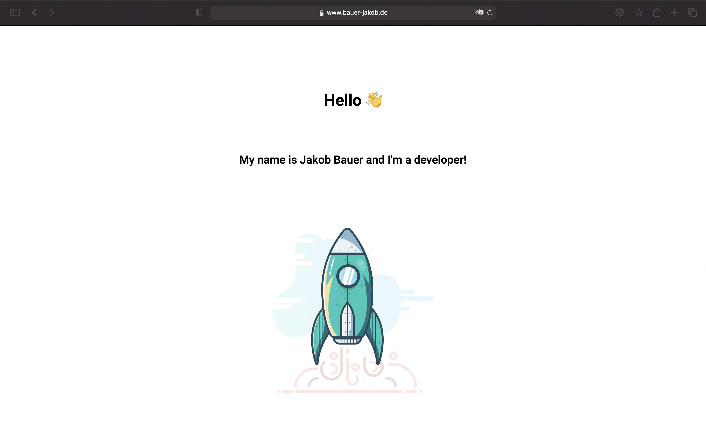

# Website  

You can check out my website at https://bauer-jakob.de/.  
 
## Local development  
Install dependencies `npm i`  
Start application `npm run start` (should serve at http://localhost:4200/**)  
 
## How to deploy
Execute command `ng build --prod`  
Push output files and folder into that repo `https://gitlab.com/bauerjakob-prod/website`  
From there nothing more to do. It automatically deploys it via webhook. 😄